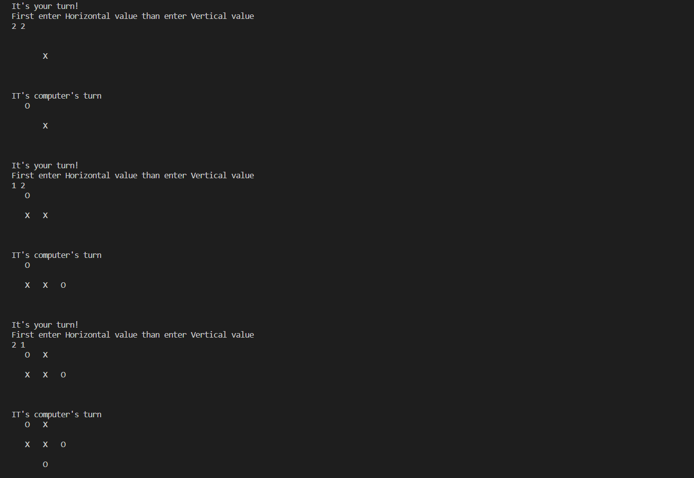

# Tic Tac Toe

Tic-tac-toe, noughts and crosses, or Xs and Os is a paper-and-pencil game for two players who take turns marking the spaces in a three-by-three grid with X or O. The player who succeeds in placing three of their marks in a horizontal, vertical, or diagonal row is the winner.
The motivation to create the game in C++ is to have a deeper understanding of the working of conditional statements and loops as the game is purely based on it and is not implemented using advanced concepts like object oriented programming

