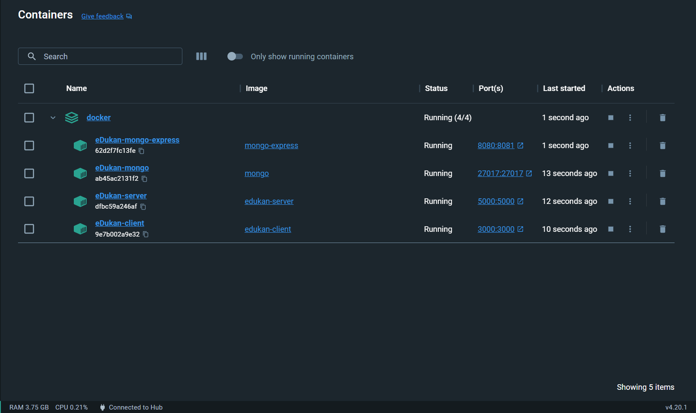

# Contanerization of a MERN stack application (eDukan) using Docker

<p>eDukan is a e-commerce platform created in the MERN stack, i.e., frontend in ReactJs, server-side development in NodeJs and ExpressJs and the database used is MongoDB. This project aims at building and running the image of the application using Docker.</p>
<p>The client side and server side images are built using Dockerfile. The client image depends on the server images while the server image itself depends on mongo image which is pulled from Docker Hub. The mongo-express image is also used to access the database.</p>
<p>The creation of containers from images and other important configurations like port-mapping, volume-mapping, network creation, etc. is automated using docker-compose where all the configurations are written in a single file and execution of that one file will pull the images and run the containers from them automatically.</p>

## Pre-requisite images

- mongo
- mongo-express

## Built images

- edukan-client
- edukan-server

## ## Creating the build and starting the services with appropriate configurations

- Create docker network

```
docker network create mongo-network
```

- Start MongoDb

```
docker run -d -p 27017:27017 --name mongodb --net mongo-network mongo
```

- Start Mongo-Express

```
docker run -d -p 8081:8081 --net mongo-network --name mongo-express -e ME_CONFIG_MONGODB_SERVER=mongodb mongo-express
```

- Start Server

```
docker run -d -p 5000:5000 --net mongo-network --name edukan_server tbhushan/edukan_server:1.0
```

- Start Client

```
docker run -d -p 3000:3000 --net mongo-network --name edukan_client tbhushan/edukan_client:1.0
```

All the containers will start on the appropriate ports.

## Creating the build and starting the services with appropriate configurations using docker compose

```
    docker-compose -f docker-compose.yaml up
```

All the containers will start on the appropriate ports.

## Ports

- The React frontend will be live on http://localhost:3000
- The backend server will start at http://localhost:5000
- MongoDB is running on http://localhost:27017
- Mongo-Express is running on http://localhost:8080

<p align='center'>
    
</p>
