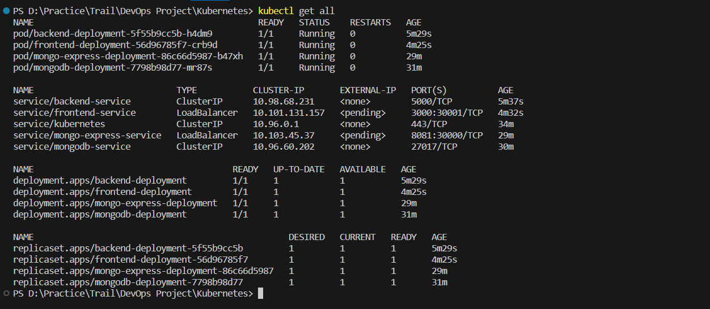

# Deployment of a MERN application over Kubernetes

<p>eDukan is a e-commerce platform created in the MERN stack, i.e., frontend in ReactJs, server-side development in NodeJs and ExpressJs and the database used is MongoDB. This project aims at deploying the application on a Kubernetes cluster using different k8s components.</p>
<p>The client side and server side images are built using Dockerfile and pushed to Docker Hub.</p>
<p>The client image is running on client-deployment while the server image is running on the server-deployment. The client-deployment communicates with the server-deployment using internal service of the server-deployment while external service is used to connect to client-deployment.</p>

## Pre-requisite images

- mongo
- mongo-express

## Built images

- edukan-client-k8s
- edukan-server-k8s

## ## Deploying the mern application

- Create internal service for mongodb

```
kubectl apply -f mongo-service.yaml
```

- Create mongodb deployment

```
kubectl apply -f mongo.yaml
```

- Create config map which contains database url

```
kubectl apply -f mongo-configmap.yaml
```

- Create external service for mongo-express

```
kubectl apply -f mongo-express-service.yaml
```

- Create mongo-express deployment

```
kubectl apply -f mongo-express.yaml
```

- Create internal service for backend

```
kubectl apply -f backend-service.yaml
```

- Create backend deployment

```
kubectl apply -f backend.yaml
```

- Create external service for backend

```
kubectl apply -f frontend-service.yaml
```

- Create frontend deployment

```
kubectl apply -f frontend.yaml
```

All the deployments will start on the appropriate ports.

<p align='center'>
    
</p>

<p align='center'>
    
</p>
