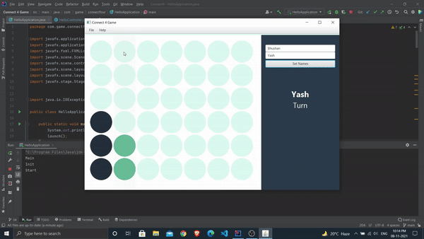

# Connect 4 Game

Desktop application of Connect 4 game written in java by implementing different concepts of object-oriented programming such as method overriding, applications of interface and abstract class, etc.

Connect Four is a two-player connection game in which the players first choose a color  and then take turns dropping colored discs from the top into a seven-column, six-row vertically suspended grid. The pieces fall straight down, occupying the next available space within the column.  The objective of the game is to be the first to form a horizontal, vertical, or diagonal line of four of one's own discs. Connect Four is a solved game. The first player can always win by playing the right moves.

### Connect 4
<!--  -->

  

### Connect With Me

