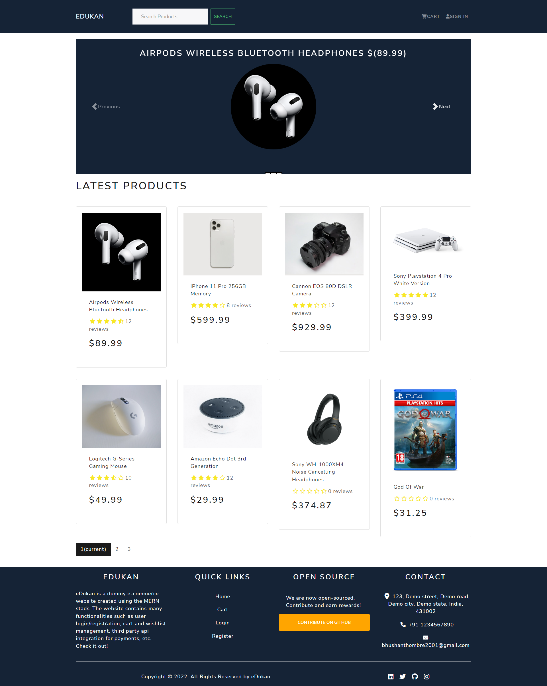

# eDukan

eDukan is a dummy e-commerce marketplace that contains a wide range of electronic products belonging to various categories like smartphones, cameras, headphones and accessories as well as other electronic accessories.

The web application is completely made using the MERN stack, i.e., frontend using React.js and backend using Node.js, Express.js and MongoDB. The local state of the application components is maintained using React Hooks while Redux is used for managing and maintaining global state of the application.

The website is deployed using Heroku
<a href="https://edukanapp.herokuapp.com/">Click here to view the Website</a>

## Key Features

- Full featured shopping cart
- Product reviews and ratings
- Top products carousel
- Product pagination
- Product search feature
- User profile with orders
- Admin product management
- Admin user management
- Admin Order details page
- Mark orders as delivered option
- Checkout process (shipping, payment method, etc.)
- PayPal / credit card integration
- Database seeder (products & users)

## eDukan

    

## App Walkthrough

The app supports basic user authentication and authorization using bcrypt.js for hashing and encrypting passwords and JsonWebToken for authorization. The user information is then stored in local storage for maintaining sessions.

A user can add an item to its cart and then proceed to checkout steps. The checkout involves 3 steps

- Shipping
- Payment
- Place Order

The payment gateway is implemented using PayPal API that supports various payment options like credit cards, debit cards, internet banking as well as pay later functionality.

Once payment is successful then the admin has the option to mark the order as delivered which is then reflected in the database. A admin user can also perform other functionalities like making other users as admin, deleting as well as editing other users and products, adding new products to the database, etc.
