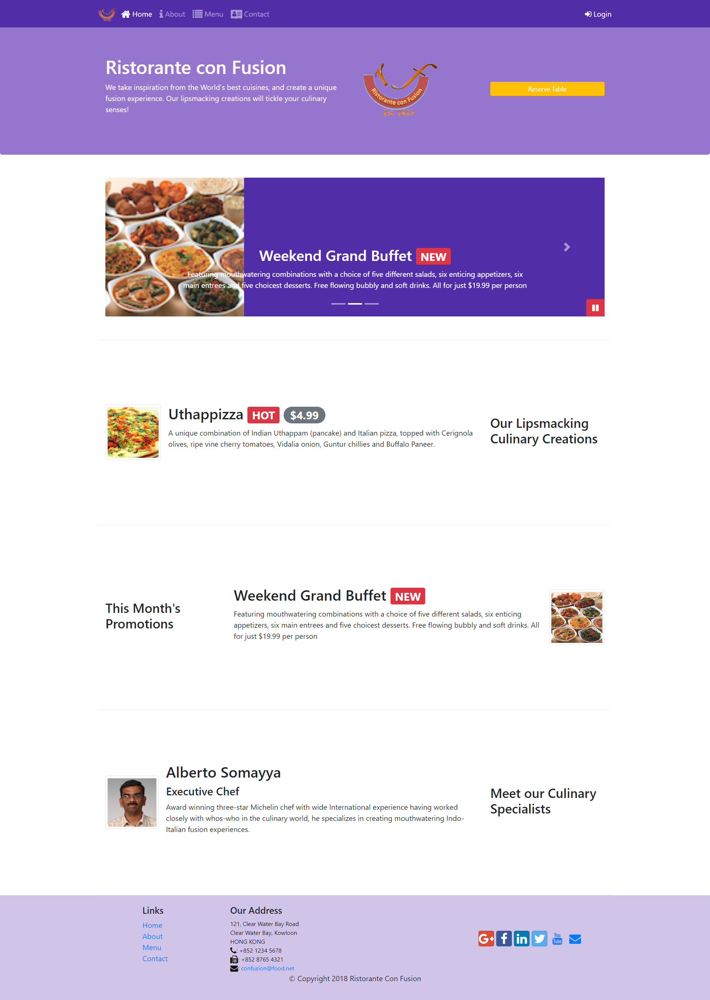

# Restorante con Fusion

Website of Restorante Con Fusion made using HTML, CSS, Bootstrap, and JavaScript. The website is completely responsive and contains all the essential components required for displaying information like modals, pop-ups, tabs, breadcrumbs, accordions, cards, etc.
All the operations in deployment of the website like minification, concatenation, JavaScript uglification, etc. are done using npm modules like cssmin, imagemin, parallelshell, and usemin along with npm scripts.

The website is deployed using Heroku
<a href="https://happy-cori-7b7416.netlify.app/">Click here to view the Website</a>

## Website

    

## Technologies Used

- HTML
- CSS (SCSS, SASS)
- Bootstrap
- JavaScript
